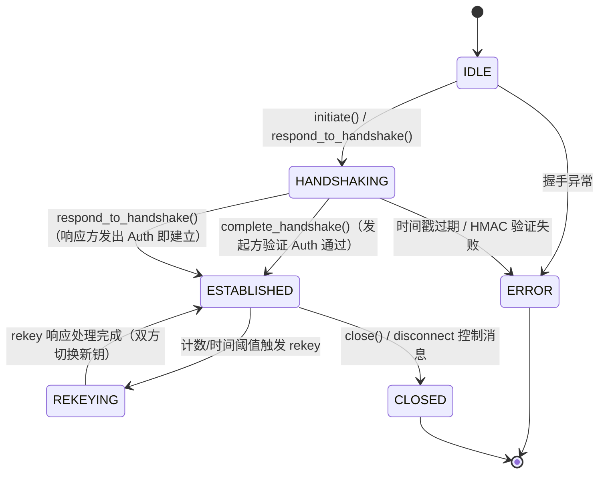

# SIP-1.0 协议规范

**SIP = Secure Inter-agent Protocol**

| | |
|---|---|
| 规范版本 | SPEC v1.0 |
| 线协议版本 | SIP-1.0 / SIP-TRANSPORT-1.0 / SIPFT1.0 |
| 状态 | Experimental / Living（随实现演进，代码为唯一事实源） |
| 参考实现 | `src/sip_protocol/`（本仓库） |
| 独立互操作实现 | `scripts/interop/reference_impl.py`（从本规范反推，不读主库源码） |
| 测试向量 | `tests/vectors/sip_test_vectors.json` |
| 最后更新 | 2026-09-11 |

> **命名声明**：本协议的 SIP 指 **Secure Inter-agent Protocol**（Agent 间端到端加密通道协议），
> 与 IETF RFC 3261 定义的 SIP（Session Initiation Protocol，VoIP 会话发起协议）**无关**：
> 无关联、无衍生、不共享任何语义或线格式。历史上部分文档曾将 SIP 展开为
> "Secure Intelligence Protocol"，自本规范起统一为 Secure Inter-agent Protocol。

> **规范地位**：本文档从 v2.1.0 实现逐字节反推写成。实现与规范不一致时，
> 以 `src/sip_protocol/` 代码为准并在 §13 登记偏差。本规范取代
> `docs/e2ee-protocol.md`（该文档保留为历史设计稿）。

---

## 目录

1. [术语与角色](#1-术语与角色)
2. [协议栈总览与消息承载](#2-协议栈总览与消息承载)
3. [密码学原语与参数](#3-密码学原语与参数)
4. [握手协议（三重 DH）](#4-握手协议三重-dh)
5. [会话密钥调度](#5-会话密钥调度)
6. [会话消息格式](#6-会话消息格式)
7. [密钥轮换（Rekey）](#7-密钥轮换rekey)
8. [防重放架构](#8-防重放架构)
9. [SIPFT1.0 加密文件工件格式](#9-sipft10-加密文件工件格式)
10. [错误码全表](#10-错误码全表)
11. [版本协商与演进策略](#11-版本协商与演进策略)
12. [安全考虑](#12-安全考虑)
13. [实现偏差登记（规范↔代码）](#13-实现偏差登记规范代码)
14. [一致性验证：规范章节 ↔ 测试交叉索引](#14-一致性验证规范章节--测试交叉索引)

---

## 1. 术语与角色

| 术语 | 定义 |
|------|------|
| **SIP** | Secure Inter-agent Protocol，本协议。与 RFC 3261 无关（见文首声明） |
| **Agent** | 协议端点。每个 Agent 拥有唯一的 `agent_id`（UTF-8 字符串，格式由宿主定义，如 `agent:hermes::session:abc`） |
| **initiator** | 握手发起方。生成 Hello，最终执行 Complete |
| **responder** | 握手响应方。接收 Hello，回 Auth |
| `PSK` | 预共享密钥（任意字节串）。用于抵抗中间人攻击：不知道 PSK 的攻击者无法派生出正确会话密钥 |
| 身份密钥对 | 长期 X25519 密钥对（可跨会话持久化），32 字节公钥 |
| 临时密钥对 | 每次握手新生成的 X25519 密钥对，用后即弃 |
| 会话密钥 | 握手派生的三元组：`encryption_key` / `auth_key` / `replay_key`，各 32 字节 |
| 会话消息 | 握手完成后双方交换的加密消息（§6） |
| 工件（artifact） | SIPFT1.0 格式的自包含加密文件（§9） |
| MUST / MUST NOT / SHOULD / MAY | RFC 2119 语义 |

角色与密钥的对应记号（全文通用）：

```
initiator:  (I_i, I_i_pub)  身份密钥对     (E_i, E_i_pub)  临时密钥对     N_i 握手 nonce
responder:  (I_r, I_r_pub)                (E_r, E_r_pub)                N_r
```

---

## 2. 协议栈总览与消息承载

```
┌────────────────────────────────────────────────┐
│ 应用层：SIPFT1.0 加密文件工件（§9，可独立使用）      │
├────────────────────────────────────────────────┤
│ 传输层：AgentMessage 信封（TEXT/ENCRYPTED/CONTROL） │
│         EncryptedChannel 状态机 + MCP Server      │
├────────────────────────────────────────────────┤
│ 协议层：握手 / 会话消息 / Rekey（本规范 §4-§8）      │
├────────────────────────────────────────────────┤
│ 原语层：X25519 · ChaCha20-Poly1305 · HKDF-SHA256   │
│         Argon2id · HMAC-SHA256（§3）               │
└────────────────────────────────────────────────┘
```

SIP 不规定底层字节流传输（TCP/stdio/消息队列/人工拷贝均可）。所有协议消息是
**JSON 对象（UTF-8）**；在 Agent 间传递时用 `AgentMessage` 信封（§2.2）承载。

### 2.1 编码约定

| 数据 | 编码 |
|------|------|
| 公钥 / nonce / 密文 / 标签（协议消息内） | Base64 标准字母表（`base64.b64encode`），**或** hex（仅握手消息的公钥/nonce 字段，见 §4.2 字段表） |
| 时间戳 | Unix 毫秒，整数 |
| 工件内二进制 | 原始字节，大端（§9） |
| 信封 JSON 序列化 | 紧凑分隔符 `(",", ":")` |
| 协议字典 HMAC 输入 | 标准 Python `json.dumps` 分隔符 `(", ", ": ")`（含空格，见 §4.4——互操作实现必须逐字节一致） |

### 2.2 AgentMessage 信封（SIP-TRANSPORT-1.0）

```
{
  "id":             "<uuid4>",                  // 消息唯一 ID
  "version":        "SIP-TRANSPORT-1.0",        // 信封版本（§11）
  "type":           "text" | "encrypted" | "control",
  "sender_id":      "<agent_id>",
  "recipient_id":   "<agent_id>",
  "timestamp":      1694390400000,              // Unix 毫秒
  "payload":        { ... },                     // 按 type 解释，见下
  "priority":       0 | 1 | 2 | 3,              // LOW/NORMAL/HIGH/URGENT
  "metadata":       { ... },                     // 任意元数据，不参与认证
  "correlation_id": "<uuid>",                    // 可选，请求-响应关联
  "hop_count":      0,                           // 三方转发追踪
  "max_hops":       10
}
```

| type | payload 结构 | 用途 |
|------|-------------|------|
| `text` | `{"text": "<明文>"}` | 未加密直通消息（接收端原样返回） |
| `encrypted` | §6 加密消息字典（整体作为 payload） | 会话消息 |
| `control` | `{"action": "...", "data": {...可选...}}` | 握手/心跳/断开/rekey 控制 |

`action` 取值：`hello` `heartbeat` `heartbeat_ack` `disconnect` `ack` `error`
`handshake_init` `handshake_complete` `rekey_request` `rekey_response`。
握手三步在信封内的映射：Hello → `action=handshake_init, data=<hello>`；
Auth → `action=handshake_complete, data=<auth>`；rekey 消息为**裸协议字典**（§7），
经信封 `action=rekey_request/response` 或 MCP 传递。

接收端处理规则：

- TTL：`now - timestamp > ttl_ms`（默认 300000ms）MUST 丢弃并报"消息已过期"。
- 跳数：`hop_count >= max_hops` MUST 拒绝。
- 未知 `action`：MUST 原样回 `[control: <action>]` 字符串（fail-open 仅为可观察性，无副作用）。
- 信封未知字段：MUST 拒绝（fail-closed，反序列化即失败）——因此演进不可向信封加字段，见 §11。

### 2.3 通道状态机（EncryptedChannel）



非 IDLE 状态调用 `initiate()`/`respond_to_handshake()` MUST 抛 `RuntimeError`；
未 ESTABLISHED 调用 `send()`/`receive()` MUST 抛 `RuntimeError`。

---

## 3. 密码学原语与参数

| 用途 | 算法 | 参数 | 模块 |
|------|------|------|------|
| 密钥交换 | X25519（RFC 7748） | 公钥 32 字节 Raw 编码 | `crypto/dh.py` |
| AEAD | **ChaCha20-Poly1305（RFC 8439）** | 256 位密钥；**96 位随机 nonce**；128 位标签 | `crypto/xchacha20_poly1305.py` |
| 密钥派生 | HKDF-SHA256（RFC 5869） | 见 §5 / §7 / §9 各标签 | `crypto/hkdf.py` |
| PSK 哈希 | Argon2id（RFC 9106） | `t=3, m=64 MiB, p=4, len=32`；盐 **固定** `b"SIPProtocolTestSalt"` | `crypto/argon2.py` |
| 认证标签 | HMAC-SHA256 | 见各消息节 | 各协议模块 |

> **AEAD 命名偏差（重要）**：模块名为 `xchacha20_poly1305`，但 Python 实现实际调用
> `cryptography.ChaCha20Poly1305`，即 **12 字节 nonce 的 ChaCha20-Poly1305**，
> **不是** 24 字节 nonce 的 XChaCha20-Poly1305（draft-irtf-cfrg-xchacha）。
> 本规范按实现记述为 ChaCha20-Poly1305；所有 wire 上的 nonce 长度均为 12 字节。
> 详见 §13 偏差 D1。

> **AES-256-GCM**（`crypto/aes_gcm.py`）为备选原语（12 字节 IV），
> 当前无任何 wire 路径引用，仅作为独立原语提供。

随机性：所有 nonce / 临时密钥 MUST 来自密码学安全随机源（`os.urandom`）。
除测试向量外，协议消息不使用确定性 nonce。

---

## 4. 握手协议（三重 DH）

### 4.1 流程总览

三步单向+双向混合流程，2 个飞行往返（ responder 在发出 Auth 时即视为建立；initiator 验证
Auth 后建立）：

```
initiator                                                responder
    │ ── Hello (I_i_pub, E_i_pub, N_i, ts) ──────────────▶ │
    │                                                     │ 验证 ts（±5min）
    │                                                     │ 生成 (I_r, E_r), N_r
    │                                                     │ 三重 DH + PSK → 会话密钥
    │ ◀───────────── Auth (I_r_pub, E_r_pub, N_r, HMAC) ── │
    │ 三重 DH + PSK → 会话密钥                              │ [ESTABLISHED]
    │ 验证 HMAC(key = auth_key)
    │ [ESTABLISHED]
    │ ── Complete (HMAC over {"status":"verified"}) ─────▶ │ （可选回执，见 4.6）
```

### 4.2 消息字段定义

**Hello**（initiator → responder，信封 `action=handshake_init`）：

| 字段 | 类型 | 编码 | 说明 |
|------|------|------|------|
| `version` | str | — | MUST 为 `"SIP-1.0"` |
| `type` | str | — | `"handshake"` |
| `step` | str | — | `"hello"` |
| `timestamp` | int | Unix ms | 生成时刻 |
| `identity_pub` | str | **hex**（64 字符） | I_i_pub，32 字节 |
| `ephemeral_pub` | str | **hex**（64 字符） | E_i_pub，32 字节 |
| `nonce` | str | **hex**（32 字符） | N_i，16 字节随机 |

**Auth**（responder → initiator，信封 `action=handshake_complete`）：

| 字段 | 类型 | 编码 | 说明 |
|------|------|------|------|
| `version` | str | — | MUST 为 `"SIP-1.0"` |
| `type` | str | — | `"handshake"` |
| `step` | str | — | `"auth"` |
| `timestamp` | int | Unix ms | 与 `auth_data` HMAC 中时间戳同一值 |
| `identity_pub` | str | hex | I_r_pub（**顶层字段，不在 HMAC 覆盖范围内**，经 KDF 隐式认证） |
| `auth_data.ephemeral_pub` | str | hex | E_r_pub |
| `auth_data.nonce` | str | hex | N_r，16 字节 |
| `signature` | str | base64 | HMAC-SHA256(auth_key, T_auth)，32 字节，见 §4.4 |

**Complete**（initiator → responder，可选回执）：

| 字段 | 类型 | 说明 |
|------|------|------|
| `version` / `type` / `step` | str | `"SIP-1.0"` / `"handshake"` / `"complete"` |
| `timestamp` | int | Unix ms |
| `auth_data` | dict | `{"status": "verified"}` |
| `signature` | str | base64(HMAC-SHA256(auth_key, `json.dumps(auth_data)`)) |

### 4.3 三重 DH 计算

双方独立计算三个共享密钥（X25519 乘法交换律保证两侧一致）：

| 记号 | initiator 视角 | responder 视角 |
|------|---------------|----------------|
| K1 | DH(I_i, E_r_pub) | DH(E_r, I_i_pub) |
| K2 | DH(E_i, I_r_pub) | DH(I_r, E_i_pub) |
| K3 | DH(E_i, E_r_pub) | DH(E_r, E_i_pub) |

实现注意（`protocol/handshake.py:127-145`）：响应方本地变量 `shared_1/shared_2`
与发起方视角互换，调用 `derive_keys_triple_dh(shared_2, shared_1, shared_3, ...)`
重排后再进 HKDF。**IKM 的规范序（initiator 视角）**：

```
IKM = K1 ‖ K2 ‖ K3 ‖ psk_hash ‖ N_i ‖ N_r
```

其中 `psk_hash = Argon2id(PSK)`（§3 参数），`N_i`/`N_r` 为握手 nonce 原始字节（各 16 字节）。

### 4.4 Auth 签名的字节级定义

```
T_auth = ASCII('{"ephemeral_pub": "' + hex(E_r_pub) + '", "nonce": "' + hex(N_r)
         + '", "timestamp": ' + decimal(ts) + '}')
signature = HMAC-SHA256(auth_key, T_auth)
```

即 Python `json.dumps({"ephemeral_pub": …, "nonce": …, "timestamp": …})` 的默认输出
（键序如上，分隔符 `", "` 与 `": "`，timestamp 无引号）。
**互操作实现必须逐字节复刻此序列化**（参考实现与测试向量已交叉验证）。
`identity_pub` 不在 T_auth 内：被篡改的 I_r_pub 会导致 initiator 派生的 K2 错误、
进而 auth_key 错误、HMAC 验证失败——隐式认证，无需显式覆盖。

### 4.5 时间戳与错误路径

| 阶段 | 检查 | 失败行为（当前实现） |
|------|------|---------------------|
| responder 收 Hello | `abs(now - ts) <= 300000 ms` | 抛 `ValueError("时间戳验证失败：消息过期")` |
| initiator 收 Auth | 同上 | 同上 |
| initiator 验 HMAC | `hmac.compare_digest` | 抛 `ValueError("HMAC签名验证失败")` |
| responder 收 Hello `version ≠ "SIP-1.0"` | 版本校验 | 抛 `VersionNegotiationError`（SIP-PROTO-003，§11） |
| initiator 收 Auth `version ≠ "SIP-1.0"` | 版本校验 | 同上 |
| 任一 hex/base64 字段非法 | 解析 | 抛 `ValueError`（库捕获层） |

通道层语义：任一握手异常 → 通道进入 ERROR 状态，统计 `errors += 1`，
错误回调触发后异常继续上抛。

### 4.6 Complete 回执的当前语义

`complete_handshake()` 生成 Complete 消息（HMAC 签名），但**当前无任何代码路径验证它**——
responder 在发出 Auth 时已单方面进入 ESTABLISHED。规范将其记述为**可选回执**：
MAY 发送；接收方 MAY 验证（key = 双方 auth_key，覆盖 `json.dumps({"status": "verified"})`）；
未验证不构成漏洞（responder 侧密钥正确性由其自身计算保证，发起方真实性由后续
首条会话消息的 AEAD 认证兜底）。见 §13 偏差 D5。

### 4.7 安全性质

- **中间人抵抗**：IKM 混入 `psk_hash`——不知道 PSK 的 MITM 无法构造正确密钥，
  Auth 的 HMAC 验证必然失败。
- **身份绑定**：K1/K2 把双方**身份**公钥与**临时**公钥交叉绑入密钥（Triple DH 经典构造），
  防未知密钥共享（UKS）。
- **前向保密**：K3 为纯临时-临时 DH；握手后销毁临时私钥（超出对象生命周期即不可再算）
  ⇒ 长期身份密钥泄露不回溯暴露会话。
- PSK 哈希使用固定盐（§13 偏差 D2）：防御目标是**在线穷举**（每次握手需完整 Argon2id +
  DH + HKDF），不依赖盐随机性；但同 PSK 的握手在盐维度无区分度，见 §12。

---

## 5. 会话密钥调度

```
                    ┌──────────────────────────────────────────┐
                    │ IKM = K1‖K2‖K3‖psk_hash‖N_i‖N_r           │
                    │ HKDF-SHA256(salt=b"SIPHandshake",         │
                    │             info=b"session-keys", L=96)   │
                    └──────────────┬───────────────────────────┘
                                   │ 连续切割
             ┌─────────────────────┼─────────────────────┐
             ▼                     ▼                     ▼
   encryption_key[0:32]     auth_key[32:64]      replay_key[64:96]
   （AEAD 消息加密）      （握手/rekey HMAC）   （replay_tag HMAC）
                                   │
                    Rekey 时（§7）：全新 ephemeral DH + 旧三元组链入
                    HKDF(salt=b"SIPRekey", info=b"SIP-rekey") → 新三元组
                                   │
                    文件工件（§9）：master_key（建议=encryption_key）
                    → header/chunk 子密钥（HKDF 独立标签树）
```

三把密钥职责**强隔离**：AEAD 永不使用 auth_key/replay_key，HMAC 永不使用
encryption_key——单一密钥泄露不横向扩散。rekey 后三元组整体轮换（§7），
旧密钥尽力擦除（bytearray 可 memset；bytes 不可变，无法保证清零，实现已知限制）。

---

## 6. 会话消息格式

### 6.1 加密消息字典（wire 格式）

`encrypt_message()` 输出，整体置于信封 `type=encrypted` 的 `payload`：

| 字段 | 类型 | 编码 | 说明 |
|------|------|------|------|
| `version` | str | — | `"SIP-1.0"` |
| `type` | str | — | `"message"` |
| `timestamp` | int | Unix ms | |
| `sender_id` | str | | 发送方 agent_id |
| `recipient_id` | str | | 接收方 agent_id |
| `message_counter` | int | | 发送方单调递增计数（从 1 起） |
| `iv` | str | base64 | **12 字节随机 nonce** |
| `payload` | str | base64 | 密文（与明文等长） |
| `auth_tag` | str | base64 | 16 字节 AEAD 标签 |
| `replay_tag` | str | hex | 64 字符，HMAC-SHA256(replay_key, `f"{sender_id}:{message_counter}"`)；提供 replay_key 时 MUST 存在 |

密文计算（**AAD = None**，会话消息不使用 AAD）：

```
(ciphertext, tag) = ChaCha20-Poly1305_SEAL(encryption_key,
                                           nonce = iv,
                                           plaintext = UTF-8(text),
                                           aad = None)
```

### 6.2 接收端处理顺序（ MUST 按序）

1. 信封 TTL 与跳数检查（§2.2）。
2. `replay_tag` 存在则 MUST 验证：重算 HMAC，`hmac.compare_digest` 比较；
   失败 → 拒绝（"重放攻击检测"）。**不存在时跳过**（兼容不带 replay_key 的
   `encrypt_message` 调用），防重放退化为第 3 步计数器。
3. `message_counter` MUST 严格大于已见最大值（`> recv_counter`）；
   否则拒绝（"消息计数器异常"）。
4. AEAD 解密：密钥错误/密文或标签被篡改 → 认证失败，拒绝；
   **错误信息不区分**密钥错误与篡改（防 oracle）。
5. 通过后 `recv_counter = message_counter`，统计更新。

明文为 UTF-8 文本（`str`），空串合法；大小仅受宿主内存限制（大 payload SHOULD
走 §9 文件工件）。

---

## 7. 密钥轮换（Rekey）

### 7.1 触发条件（SHOULD，`ChannelConfig` 默认值）

| 条件 | 默认阈值 | reason 值 |
|------|---------|-----------|
| 发送计数 ≥ `rekey_after_messages` | 10000 | `message_limit` |
| 接收计数 ≥ `rekey_after_messages` | 10000 | `message_limit` |
| 建立时长 ≥ `rekey_after_seconds` | 3600 | `scheduled` |
| 手动调用 | — | `manual` |

### 7.2 消息格式

**Rekey_Request**（initiator → responder，裸协议字典）：

| 字段 | 类型 | 说明 |
|------|------|------|
| `version` / `type` / `step` | str | `"SIP-1.0"` / `"rekey"` / `"request"` |
| `timestamp` | int | Unix ms |
| `sequence` | int | 轮换序号，首次 0，之后**严格递增** |
| `request.ephemeral_pub` | str | base64，32 字节新临时公钥 |
| `request.nonce` | str | base64，16 字节随机 |
| `request.reason` | str | `scheduled` / `manual` / `message_limit` |
| `request.key_lifetime` | int | 建议新钥生命周期（秒），默认 3600 |
| `signature` | str | base64(HMAC-SHA256(**当前** auth_key, `f"16:{eph}:{non}:{reason}:{lifetime}"`))，其中 `eph`/`non` 为字段 base64 字符串原文 |

**Rekey_Response**（responder → initiator）：

| 字段 | 类型 | 说明 |
|------|------|------|
| `version` / `type` / `step` | str | `"SIP-1.0"` / `"rekey"` / `"response"` |
| `timestamp` | int | Unix ms |
| `sequence` | int | **MUST 等于请求的 sequence** |
| `response.ephemeral_pub` | str | base64，responder 新临时公钥 |
| `response.nonce` | str | base64，16 字节随机 |
| `signature` | str | base64(HMAC-SHA256(当前 auth_key, `f"16:{eph}:{non}"`)) |

签名串中的前缀 `16` 为 REKEY_NONCE_LENGTH 常量（域分离）。

### 7.3 验证规则（验证方 MUST 全部通过）

1. 时间戳 ±300000 ms；
2. 签名恒定时间比对（key = 轮换前 auth_key）；
3. 请求 `sequence` 严格大于本地已见值（首次为 0 时合法）；
4. 响应 `sequence` 等于发起方请求所用序号；
5. `version` 为 `"SIP-1.0"`。

任一失败：请求/响应判无效（验证函数返回 False；处理函数抛
`ValueError("Invalid rekey request/response")`），密钥**不**切换。

### 7.4 新密钥派生（双方一致）

```
shared = X25519(E_new_local, E_new_peer)          // 全新临时-临时 DH
IKM    = shared ‖ encryption_key ‖ auth_key ‖ replay_key   // 旧三元组链入
         ‖ N_req ‖ N_resp                          // 请求方 nonce 在前
OKM    = HKDF-SHA256(IKM, salt=b"SIPRekey", info=b"SIP-rekey", L=96)
new(encryption_key, auth_key, replay_key) = OKM[0:32] ‖ OKM[32:64] ‖ OKM[64:96]
```

### 7.5 应用与切换时序

- responder：`process_rekey_request()` 内验证→派生→**立即应用**新钥→回 Response。
  （若 Response 丢失，双方密钥失同步，会话需重握手——当前协议无回滚，见 §12。）
- initiator：`process_rekey_response()` 内验证→派生→应用→清理临时态。
- 应用 = 旧密钥尽力擦除 + 三元组替换 + `rekey_count += 1`，通道回到 ESTABLISHED。
- 前向保密性质：旧三元组与全新 ephemeral DH 混合链入 ⇒ 单次会话密钥泄露不影响
  其后轮换的密钥；但 IKM 含旧钥 ⇒ rekey **不是**全新 Triple DH，旧钥泄露瞬间发起的
  主动攻击（攻击者持旧钥冒充发起 rekey）在 HMAC 链上无独立防线——依赖 PSK 身份层
  与传输保护，见 §12。

---

## 8. 防重放架构

四层防线（按消息生命周期）：

| 层 | 机制 | 参数 | 状态 |
|----|------|------|------|
| L1 新鲜度 | 握手/控制时间戳 ±5min；会话消息信封 TTL 默认 5min | 300000 ms | 生效 |
| L2 认证标签 | `replay_tag = HMAC-SHA256(replay_key, "{sender_id}:{counter}")` 恒定时间比对 | 32 字节 | 生效（§6.2 步骤 2） |
| L3 单调计数器 | `message_counter` 严格递增（每方向独立） | — | 生效（§6.2 步骤 3） |
| L4 nonce 簿记 | `NonceManager`：24 字节随机 nonce，OrderedDict FIFO，容量超 1000 淘汰最旧 | 24B / 1000 | **原语就绪但未接入通道收发路径**（§13 偏差 D3）；会话消息的 12 字节 AEAD iv 随机不簿记 |

L2 的 replay_tag 把 (sender_id, counter) 绑定到会话专属 replay_key ⇒ 跨会话/跨发送者
的标签不可移植；L3 拒绝同会话内的任何回退/重放；两者缺一即降级——SPEC 要求接收端
两者都实施（§6.2）。

---

## 9. SIPFT1.0 加密文件工件格式

自包含加密文件（扩展名 `.sipft`），与通道无关，master_key（32 字节）经任意带外渠道共享。

### 9.1 二进制布局（大端）

```
偏移      长度          内容
0         8             MAGIC = ASCII "SIPFT1.0"（明文，并作为 AAD 参与认证）
8         4             header_len：uint32 BE
12        12            header_nonce
24        header_len    header_ciphertext（明文为头部 JSON，见 9.2）
24+L      16            header_tag
之后      每块一帧      chunk_nonce(12) ‖ chunk_ct(期望长度) ‖ chunk_tag(16)
```

`header_len` = 头部**密文**长度（与明文等长，AEAD 无填充）。
工件 MUST 精确终止于最后一块帧尾——任何尾部多余字节判损坏（防拼接）。

### 9.2 头部 JSON（认证的元数据）

```json
{
  "format": 1,
  "file_id": "<32 字符 hex，16 字节随机>",
  "file_name": "<原始文件名>",
  "mime_type": "<猜测或 application/octet-stream>",
  "total_size": 12345,
  "chunk_size": 1048576,
  "total_chunks": 12,
  "created_at": "<ISO 8601 UTC>"
}
```

### 9.3 密钥调度（HKDF-SHA256 标签树）

```
header_key = HKDF(master_key, salt=b"SIP-FileTransfer", info=b"header",     L=32)
chunk_key_i = HKDF(master_key, salt=file_id（16 字节原始值）, info=b"chunk:{i}", L=32)
```

`i` 为十进制 ASCII（`b"chunk:0"`, `b"chunk:1"`, …）。每块独立密钥 ⇒ 单块密钥泄露
不扩散；file_id 作盐 ⇒ 密钥绑定到本工件（跨工件拼接失效）。

### 9.4 AAD 与 tag 链

```
AAD(header)   = MAGIC
AAD(chunk_i)  = MAGIC ‖ file_id ‖ uint32_BE(i) ‖ prev_tag      // 共 8+16+4+16 = 44 字节
prev_tag 初值 = header_tag；此后 prev_tag_{i} = chunk_tag_{i-1}
```

链式 AAD 保证：任一块密文/标签被改、块序重排、块删除、跨工件移植（file_id 不同）、
尾部截断，均在解包时**于对应块**认证失败（fail-fast），已解出的内容不落盘
（临时文件 + 全部通过后原子替换）。

### 9.5 尺寸与安全边界

| 约束 | 值 | 违反时 |
|------|-----|--------|
| 头部密文长度 | ≤ 64 KiB | `ArtifactCorruptedError`（SIP-FILE-003） |
| total_chunks | ≤ 65536 | SIP-FILE-003 |
| chunk_size | 1 KiB .. 16 MiB（默认 1 MiB） | SIP-FILE-003 |
| total_size | ≤ 5 GiB | `FileTooLargeError`（SIP-FILE-002，打包侧） |
| total_chunks | MUST == ceil(total_size / chunk_size) | SIP-FILE-003（防伪造头部） |
| 解出总字节数 | MUST == total_size | SIP-FILE-003 |
| MAGIC | MUST 精确等于 `b"SIPFT1.0"` | SIP-FILE-003 |
| header JSON `format` | MUST == 1 | SIP-FILE-003（版本拒绝点，§11） |

### 9.6 解包行为

- 头部认证失败 ⇒ SIP-FILE-003；**密钥错误与工件被篡改不可区分**（防 oracle）。
- 任一块认证失败 ⇒ `ChunkIntegrityError`（SIP-FILE-001，`details.chunk_index` 指明块号）。
- 输出路径：头部文件名经 basename 清洗（路径穿越不可能）；同名冲突追加 `" (2)"`、
  `" (3)"`…；中途失败不残留半成品。

---

## 10. 错误码全表

### 10.1 SIP-xxx 异常码（`exceptions.py`，dataclass + 注册表，可序列化跨 Agent 传输）

| 错误码 | 异常类 | 默认 severity | recoverable | wire 使用现状 |
|--------|--------|--------------|-------------|---------------|
| SIP-ERROR-000 | `SIPError` | medium | ✓ | 基类 |
| SIP-CRYPTO-000 | `CryptoError` | medium | ✓ | 保留（未在收发路径抛出） |
| SIP-CRYPTO-001 | `EncryptionError` | medium | ✓ | 保留 |
| SIP-CRYPTO-002 | `DecryptionError` | medium | ✗ | 保留（解密失败现以 ValueError 上抛） |
| SIP-CRYPTO-003 | `KeyDerivationError` | medium | ✗ | 保留 |
| SIP-PROTO-000 | `ProtocolError` | medium | ✓ | 基类 |
| SIP-PROTO-001 | `HandshakeError` | medium | ✓ | 保留（握手失败现以 ValueError 上抛） |
| SIP-PROTO-002 | `RekeyError` | medium | ✓ | 保留 |
| **SIP-PROTO-003** | `VersionNegotiationError` | medium | ✓ | **生效**：握手版本不匹配（§4.5、§11） |
| SIP-PROTO-004 | `FragmentError` | medium | ✓ | 保留（v2.0 已移除分片功能） |
| SIP-MSG-000 | `MessageError` | medium | ✓ | 基类 |
| **SIP-MSG-001** | `MessageSchemaError` | medium | ✓ | **生效**：信封版本不匹配（§11） |
| SIP-MSG-002 | `MessageExpiredError` | medium | ✓ | 保留（过期现以 ValueError 上抛） |
| SIP-TRANSPORT-000 | `TransportError` | medium | ✓ | 基类 |
| SIP-TRANSPORT-001 | `SIPConnectionError` | medium | ✓ | 保留 |
| SIP-TRANSPORT-002 | `AdapterError` | medium | ✓ | 保留（v2.0 已移除平台适配器） |
| SIP-AGENT-000..004 | `AgentError` 系 | medium | ✓ | 保留（v2.0 已移除 agent 编排） |
| SIP-GROUP-000..002 | `GroupError` 系 | medium | ✓ | 保留（v2.0 已移除群组） |
| SIP-FILE-000 | `FileTransferError` | medium | ✓ | **生效**：打包 I/O / 源文件并发改动 |
| SIP-FILE-001 | `ChunkIntegrityError` | high | ✗ | **生效**：块认证失败（§9.6） |
| SIP-FILE-002 | `FileTooLargeError` | medium | ✓ | **生效**：超 5 GiB |
| SIP-FILE-003 | `ArtifactCorruptedError` | high | ✗ | **生效**：魔数/头部/截断/格式非法 |

> "保留"= 注册在案、类型系统完整、测试覆盖序列化往返，但当前收发路径用 `ValueError`
> 表达同类失败。这是有意的低摩擦上抛风格（调用方 `except ValueError` 即可）；
> SIP-xxx 码的用途是**跨 Agent 结构化传输错误**（`to_dict()/from_dict()`），见偏差 D4。

### 10.2 MCP JSON-RPC 错误码（stdio 传输）

| 码 | 含义 |
|----|------|
| -32700 / -32600 / -32601 / -32602 / -32603 | JSON-RPC 2.0 标准码 |
| -32001 | 通道未初始化即调用工具 |
| -32002 | 握手未完成即加密/解密/rekey |
| -32003 / -32004 | 加密/解密失败 |
| -32005 | 握手失败（含版本不匹配经 ValueError 通道映射至此） |
| -32006 | rekey 失败 |

---

## 11. 版本协商与演进策略

### 11.1 版本标识清单（现状审计）

| 标识 | 取值 | 携带位置 | 校验现状 |
|------|------|---------|---------|
| 协议版本 | `"SIP-1.0"` | 握手 hello/auth/complete、会话消息、rekey 请求/响应 | **本规范起强制**（feat/protocol-spec 合入）：responder 收 Hello、initiator 收 Auth、rekey 双向校验，不匹配即拒（见下） |
| 信封版本 | `"SIP-TRANSPORT-1.0"` | AgentMessage.version | **本规范起强制**：`from_dict` 反序列化即校验 |
| 工件魔数 | `b"SIPFT1.0"` | 工件头 8 字节 | **始终强制**（精确匹配，v2.1 起即有） |
| 工件格式号 | `1` | 头部 JSON `format` | **始终强制** |

### 11.2 拒绝行为（MUST）

收到不认识的版本，接收端 MUST **在做任何密码学计算之前**拒绝：

- 握手：抛 `VersionNegotiationError`（SIP-PROTO-003；该类同时继承 ValueError，
  保持既有 `except ValueError` 捕获路径兼容，MCP 映射 -32005）。
- 信封：反序列化抛 `MessageSchemaError`（SIP-MSG-001，同上双继承）。
- rekey：`validate_rekey_request/response` 返回 False（bool 语义与既有校验一致）。
- 工件：`ArtifactCorruptedError`（既有行为）。

拒绝消息 MUST NOT 回显任何密钥派生中间值；单版本协议无降级协商——不存在
"以旧版本继续"的路径（防降级攻击）。

### 11.3 演进规则

- **SIP-1.x（补丁演进）**：MAY 增加协议字典（握手/消息/rekey 的 JSON）内的**可选新字段**——
  接收端按键取值、忽略未知键，天然后向兼容；MUST NOT 修改既有字段语义/编码/HMAC 输入串。
- **信封（SIP-TRANSPORT-x）**：反序列化 fail-closed（未知字段即 `TypeError` 拒绝），
  因此信封**永不做加字段的兼容演进**——需要新信封能力时升 major，新版本互相拒绝。
- **SIP-2.0（不兼容演进）**：版本串变更；旧端点按 §11.2 拒绝。若未来引入协商，
  仅允许在 Hello 明文段声明支持集，且降级必须双方显式确认（SHOULD 同时签入 HMAC）。
- **SIPFT**：魔数内嵌版本（`SIPFT1.0`）；`SIPFT2.0` 是新魔数=新格式，旧端点按魔数
  不符拒绝。头部 `format` 字段为头部 JSON 自身的次级版本闸。
- 密码算法更换（如真 XChaCha20 或后量子 KEX）属 SIP-2.0 级变更（见设计稿
  `docs/superpowers/specs/2026-04-22-post-quantum-kex-design.md`）。

---

## 12. 安全考虑

**威胁模型**：攻击者控制传输通道（读写/重放/重排/注入），不掌握 PSK 与任一端私钥。

1. **降级**：无版本协商即无降级面；版本字段强制校验（§11.2）。
2. **重放**：L1-L3 三层生效防线（§8）；握手消息本身由时间戳 + PSK 绑定密钥的 HMAC
   防重放注入（旧 Hello 重放 → 时间戳窗或密钥 HMAC 拦截）。
3. **截断/拼接（工件）**：tag 链 + 精确 EOF + file_id 盐（§9.4）。
4. **时序**：HMAC 与 AEAD 比较均恒定时间。
5. **密钥错误 oracle**：解密失败统一错误信息（不区分密钥错/密文坏）。
6. **nonce 碰撞（会话消息）**：12 字节随机 nonce，同密钥下生日界 ≈ 2^48 消息；
   默认 rekey 阈值 10000 条消息 ⇒ 实际暴露 ≪ 界限。高吞吐场景 SHOULD 调低
   `rekey_after_messages`。
7. **PSK 强度**：Argon2id（t=3, m=64MiB, p=4）拉伸；PSK 熵 SHOULD ≥ 128 位；
   弱 PSK 仍可能被离线穷举（固定盐不增加每次猜测成本之外的保护，D2）。
8. **rekey 失同步**：Response 丢失 ⇒ 双方密钥失同步且无回滚（§7.5），
   需重握手；宿主 SHOULD 对 rekey 失败做重握手兜底。
9. **内存**：Python 运行时下密钥擦除为尽力而为（bytes 不可变，D6）；
   `rekey.apply_new_keys` 仅擦除 bytearray 形态旧钥。
10. **不在范围**：流量分析、元数据保护、后量子安全、密钥托管、拒绝服务（传输层职责）。

---

## 13. 实现偏差登记（规范↔代码）

按"代码为唯一事实源、规范如实记述、不擅自改代码"的原则登记。D7 为本次 SPEC
工程中经批准的最小补齐（单独 commit），其余为记录在案待决事项。

| # | 偏差 | 现状 | 风险评估 | 处置 |
|---|------|------|---------|------|
| D1 | 模块名 `xchacha20_poly1305` 实为 **ChaCha20-Poly1305（12B nonce）** | 全部 wire 路径 12B nonce | 无安全风险（RFC 8439 标准构造）；命名误导 | 规范如实记述；改名属破坏性 API 变更，留待 SIP-2.0 |
| D2 | Argon2id 固定盐 `b"SIPProtocolTestSalt"` | 双方必须一致才能派生同密钥，盐无法逐握手随机 | 在线穷举成本不变；离线预表理论可行（同 PSK 全局同盐） | 接受；盐已事实上是域常量（domain separator） |
| D3 | `NonceManager`（24B FIFO）在 `EncryptedChannel` 实例化但**未接线**收发路径 | 防重放实际由 replay_tag + 计数器承担（§8 L2/L3） | 功能等价性成立；簿记层冗余 | 记录在案；接线或移除留待后续（行为无差异，不动） |
| D4 | 协议路径错误以 `ValueError` 上抛，SIP-xxx 异常仅 filetransfer 路径生效 | §10.1"wire 使用现状"列 | 调用方体验一致；跨 Agent 结构化错误未覆盖握手/消息路径 | 记录在案；全量切换属 API 破坏性变更，留待 major |
| D5 | Complete 回执 HMAC 无验证路径 | responder 发 Auth 即单方建立 | 无漏洞（§4.6 论证），语义为可选回执 | 规范降格记述为 MAY |
| D6 | 旧密钥擦除仅 bytearray 有效 | bytes 不可变 | CPython 运行时固有 | 文档化（§12.9） |
| D7 | 版本字段曾存在但无校验 | **已补齐**（本次 SPEC 工程）：握手双向 + rekey + 信封 + 既有工件魔数 | 单版本协议，拒绝即正确语义 | `feat/protocol-spec` 单独 commit，diff 见 CHANGELOG [Unreleased] |
| D8 | 信封 `from_dict` 对未知字段 fail-closed（`TypeError` 未被 `parse_raw_message` 包装） | 演进约束已写入 §11.3 | 与 fail-closed 意图一致 | 记录在案 |

---

## 14. 一致性验证：规范章节 ↔ 测试交叉索引

> 本节是规范的**可信度锚点**：SPEC 每条 wire 语义都必须有测试盯着。
> 239 个既有用例 + 本次新增互操作/版本用例（`test_interop.py`、`test_version_validation.py`）。
> 交叉索引由 `tests/test_spec_index.py` 机器校验（断言本表引用的测试文件与用例名真实存在）。

| 规范章节 | 测试文件 | 关键用例 |
|---------|---------|---------|
| §2.2 信封格式/序列化 | `test_transport.py` | `TestAgentMessage::test_message_serialization` `test_message_to_dict` `test_message_from_dict` `test_message_serialization_roundtrip` `test_parse_raw_message_valid/invalid` `test_all_message_types` `test_all_control_actions` `test_all_priorities` |
| §2.2 TTL/跳数 | `test_transport.py` | `test_message_expiration` `test_message_hop_count` `test_expired_message_detection` |
| §2.3 通道状态机 | `test_transport.py` | `test_channel_state_transitions` `test_initiate_from_non_idle_state` `test_respond_from_non_idle_state` `test_send_before_established` `test_receive_before_established` `test_state_change_callback` `test_channel_close` |
| §3 原语（AEAD/HKDF/X25519） | `test_sip_protocol.py` | `test_basic_handshake` `test_message_encryption`；AAD 原语：`test_filetransfer.py::TestAeadAadPrimitive` |
| §4 握手全流程 | `test_triple_dh_handshake.py` `test_integration.py` `test_transport.py` `test_mcp_server.py` | `test_triple_dh_handshake` `test_full_handshake_flow` `TestEncryptedChannel::test_full_handshake` `TestSIPHandshake::test_full_handshake` |
| §4.5 时间戳窗口 | `test_sip_protocol.py` | `test_timestamp_validation` |
| §4.5 HMAC 验证失败 | `test_interop.py`（新增） | `TestVectorReplay::*tampered*`（篡改 Auth 签名/HMAC 覆盖串负路径） |
| §4.7 错误 PSK → 解密失败 | `test_transport.py` | `test_different_psk_fails_decryption` |
| §5 密钥调度（两侧一致性） | `test_interop.py`（新增） | `TestVectorReplay`（参考实现独立复算三元组）；`test_rekey.py::test_rekey_forward_secrecy` |
| §6.1 加密消息字典 | `test_transport.py` `test_mcp_server.py` | `test_send_receive_message` `test_multiple_messages` `test_bidirectional_communication` `TestSIPEncryptDecrypt::test_encrypt_decrypt_roundtrip` `test_multiple_messages` |
| §6.2 接收处理顺序（L2/L3） | `test_transport.py` `test_sip_protocol.py` | `test_replay_attack_detection` `test_replay_tag` |
| §6.2 步骤 4 解密拒绝 | `test_transport.py` | `test_different_psk_fails_decryption`；`test_filetransfer.py::TestAeadAadPrimitive::test_aad_roundtrip_and_mismatch`（AEAD 层） |
| §7 Rekey 全流程 | `test_rekey.py` | `test_rekey_request_creation` `test_rekey_request_validation` `test_rekey_request_invalid_signature` `test_rekey_response_creation` `test_rekey_response_validation` `test_rekey_complete_flow` `test_rekey_timestamp_validation` `test_rekey_sequence_validation` `test_rekey_forward_secrecy` |
| §7 Rekey E2E | `test_rekey_e2e.py` `test_mcp_server.py` | `test_full_rekey_flow` `test_rekey_sequence_check` `test_tampered_rekey_request` `test_rekey_keys_are_unique` `test_secure_wipe_called_on_apply`；`TestSIPRekey::test_rekey_roundtrip` |
| §8 L4 NonceManager | `test_nonce_coverage.py` `test_sip_protocol.py` | 全部 13 用例（`test_nonce_length_is_24` `test_eviction_when_over_1000` 等）；`test_nonce_management` |
| §5/§8 SessionState 序列化 | `test_session.py` | `TestSessionStateSerialize/Deserialize/Roundtrip` 全部 12 用例 |
| §9 SIPFT 往返 | `test_filetransfer.py` | `TestRoundtrip`（5 尺寸参数化 + 元数据 + 非确定性 + 自定义块大小） |
| §9.4 tag 链/AAD | `test_filetransfer.py` | `TestIntegrityRejection`（篡改密文/标签、重排、删块、截断、尾垃圾、错钥、坏魔数、篡改头、跨工件拼接 10 用例）；`TestAeadAadPrimitive::test_aad_chain_binds_order` |
| §9.5 边界 | `test_filetransfer.py` | `TestBoundariesAndSafety`（超大文件、非法块大小、路径穿越清洗、冲突重命名、失败无残留 8 用例） |
| §9 流式常量内存 | `test_filetransfer.py` | `TestStreaming::test_pack_unpack_streaming_memory` |
| §10.1 错误码/注册表 | `test_exceptions.py` | `TestErrorRegistry::test_all_errors_registered` `TestSubclassFromDictRoundtrip`（全类参数化往返）等 40 用例 |
| §10.2 MCP JSON-RPC | `test_mcp_server.py` | `TestJSONRPCHelpers` `TestJSONRPCRouting`（含 `test_invalid_jsonrpc_version` `test_unknown_tool_call`）`TestMCPIntegration::test_full_flow_handshake_encrypt_decrypt` |
| §11 版本强制（D7 补齐） | `test_version_validation.py`（新增） | 握手/信封/rekey/工件四路版本拒绝 + 兼容正路径 |
| §11 工件版本（魔数） | `test_filetransfer.py` | `test_corrupted_magic_rejected` |
| 三方/多轮会话 | `test_e2e_three_party.py` `test_transport.py::TestThreePartyCommunication` | MCP 三进程 E2E；6 用例三方握手/转发/独立通道 |
| 互操作（第二实现） | `test_interop.py`（新增） | 测试向量回放 + 与主库活体对话（握手→消息→rekey 双向） |
| 性能基线 | `test_performance.py` | `test_high_frequency_messages` `test_stress_test` |

**向量与互操作验证链**：`scripts/interop/generate_vectors.py`（主库导出握手中间态/
密钥/密文/tag 到 `tests/vectors/sip_test_vectors.json`）→ `scripts/interop/reference_impl.py`
（仅依本规范实现，独立 HKDF/密钥调度/ HMAC transcript/AEAD 调用）→ `test_interop.py`
双向断言。CI 每次运行重新生成向量并回放，另校验仓库内静态向量可被参考实现消费。

---

*End of SIP-1.0 SPEC v1.0*
